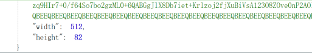

- **服务介绍**

  前端注记数据服务接口根据应用终端发送的http协议请求，将对应地图的注记数据返回给用户终端的服务；前端注记数据服务支持256和512的标准格网请求。

- **参数说明**

<table>
<tr>
    <td rowspan="2">服务地址 
    <td colspan="3">http://ip:port/mapserver/label/{serviceName}/getImgData?x={x}&y={y}&l={l}&styleId={styleId}&ratio={ratio}&tilesize={tilesize}</td>
</tr>
<tr>  
    <td colspan="3">http://ip:port/mapserver/label/{serviceName}/{styleId}/getImgData/{l}/{y}/{x}/{tilesize}/{ratio}?control={control}&controlId={controlId}&mask={mask}</td>
</tr>
    <td width="20%">服务描述 
    <td colspan="3">前端注记数据服务接口根据应用终端发送的http协议请求，将对应地图的注记数据返回给用户终端的服务；前端注记数据服务支持256和512的标准格网请求。</td>
</tr>
<tr>
    <td width="20%">请求方式 
    <td colspan="3"> GET</td>
</tr>
<tr>
    <td rowspan="10">参数说明 
    <td>参数名</td>
    <td>描述</td>
    <td>是否必要</td>
</tr>
<tr>
    <td>serviceName</td>
    <td>服务名称</td>
    <td>是</td>
</tr>
<tr>
    <td>styleId</td>
    <td>矢量瓦片电子地图样式id，可以为同一个服务提供多个样式</td>
    <td>是</td>
</tr>
<tr>
    <td>x</td>
    <td>瓦片行号</td>
    <td>是</td>
</tr>
<tr>
    <td>y</td>
    <td>瓦片列号</td>
    <td>是</td>
</tr>
<tr>
    <td>l</td>
    <td>瓦片层级</td>
    <td>是</td>
</tr>
<tr>
    <td>tilesize</td>
    <td>瓦片大小  256/512，默认为512</td>
    <td>否</td>
</tr>
<tr>
    <td>ratio</td>
    <td>是否高清，其中：1为非高清版本，2为高清版本，默认为1</td>
    <td>否</td>
</tr>
<tr>
    <td width="20%">返回值类型 
    <td colspan="3">Json</td>
</tr>
<tr>
    <td width="20%">返回值说明 
    <td colspan="3">  { 
&nbsp;&nbsp;&nbsp;&nbsp;“content”: [{//注记内容数组 
   &nbsp;&nbsp;&nbsp;&nbsp;&nbsp;&nbsp;&nbsp;&nbsp; “rowNums”:, //行号 
    &nbsp;&nbsp;&nbsp;&nbsp;&nbsp;&nbsp;&nbsp;&nbsp;“label”:””, //注记名称 
    &nbsp;&nbsp;&nbsp;&nbsp;&nbsp;&nbsp;&nbsp;&nbsp;“id”:””, //注记编号 
    &nbsp;&nbsp;&nbsp;&nbsp;&nbsp;&nbsp;&nbsp;&nbsp;“offset”:””, //缩略图中主机名称位置 
    &nbsp;&nbsp;&nbsp;&nbsp;&nbsp;&nbsp;&nbsp;&nbsp;“location”:{//注记在地图中的位置 
       &nbsp;&nbsp;&nbsp;&nbsp;&nbsp;&nbsp;&nbsp;&nbsp;&nbsp;&nbsp;&nbsp;&nbsp; “x”:, //经度 
       &nbsp;&nbsp;&nbsp;&nbsp;&nbsp;&nbsp;&nbsp;&nbsp;&nbsp;&nbsp;&nbsp;&nbsp; “y”:, //纬度 
        &nbsp;&nbsp;&nbsp;&nbsp;&nbsp;&nbsp;&nbsp;&nbsp;}, 
    &nbsp;&nbsp;&nbsp;&nbsp;&nbsp;&nbsp;&nbsp;&nbsp;“texture”: //图标编号 
&nbsp;&nbsp;&nbsp;&nbsp;}, …], 
&nbsp;&nbsp;&nbsp;&nbsp;“image”: “”, //请求格网包含注记名称缩略图，base64格式 
&nbsp;&nbsp;&nbsp;&nbsp;“width”: , //缩略图宽 
&nbsp;&nbsp;&nbsp;&nbsp;“height”: //缩略图高 
}</td>
</tr>
<tr>
    <td rowspan="2">请求示例 
    <td colspan="3"><a href ="http://10.1.102.52:8021/mapserver/label/全国行政区划/getImgData?x=105&y=21&l=8&styleId=默认&tilesize=512" target="_blank">http://10.1.102.52:8021/mapserver/label/全国行政区划/getImgData?x=105&y=21&l=8&styleId=默认&tilesize=512</a></td>
</tr>
<tr>  
    <td colspan="3"><a href ="http://10.1.102.52:8021/mapserver/label/全国行政区划/默认/getImgData/8/21/105/512/1" target ="_blank">http://10.1.102.52:8021/mapserver/label/全国行政区划/默认/getImgData/8/21/105/512/1</a></td>
</tr>
<tr>
    <td width="20%">备注 
    <td colspan="3"></td>
</tr>
</table>

