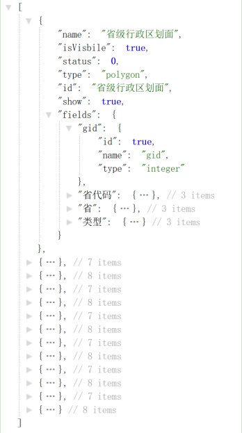

- **服务介绍**

   根据服务名称获取该服务的所有图层信息，为图层的过滤等接口调用提供基本信息。
   
- **参数说明**

<table>
<tr>
    <td>服务地址 
    <td colspan="3">http://ip:port/mapserver/styleInfo/{serviceName}/{styleId}/layer.json</td>
</tr>
    <td width="20%">服务描述 
    <td colspan="3">根据服务名称获取该服务的所有图层信息，为图层的过滤等接口调用提供基本信息。</td>
</tr>
<tr>
    <td width="20%">请求方式 
    <td colspan="3"> GET</td>
</tr>
<tr>
    <td rowspan="3">参数说明 
    <td>参数名</td>
    <td>描述</td>
    <td>是否必要</td>
</tr>
<tr>
    <td>serviceName</td>
    <td>服务名称</td>
    <td>是</td>
</tr>
<tr>
    <td>styleId</td>
    <td>矢量瓦片电子地图样式id，可以为同一个服务提供多个样式</td>
    <td>是</td>
</tr>
<tr>
    <td width="20%">返回值类型 
    <td colspan="3">json</td>
</tr>
<tr>
    <td width="20%">返回值说明 
    <td colspan="3"></td>
</tr>
<tr>
    <td>请求示例 
    <td colspan="3"><a href ="http://10.1.102.52:8021/mapserver/styleInfo/全国行政区划/默认/layer.json">http://10.1.102.52:8021/mapserver/styleInfo/全国行政区划/默认/layer.json</a></td>
</tr>
<tr>
    <td width="20%">备注 
    <td colspan="3"></td>
</tr>
</table>

