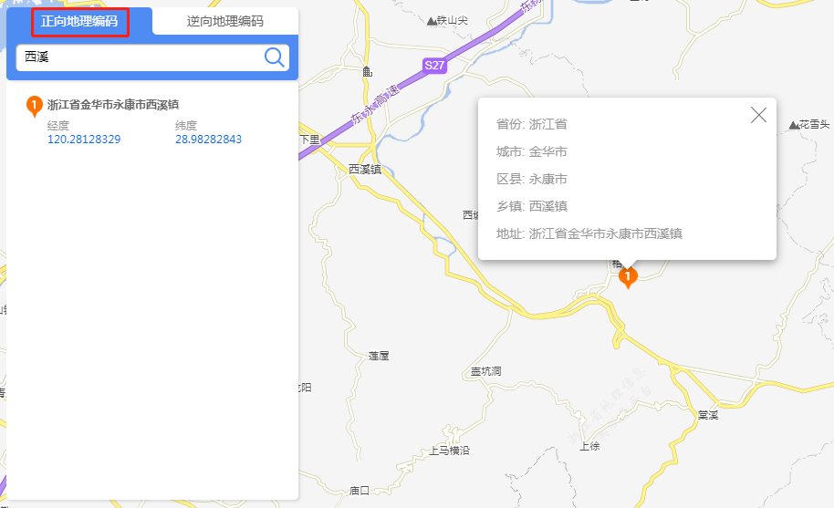
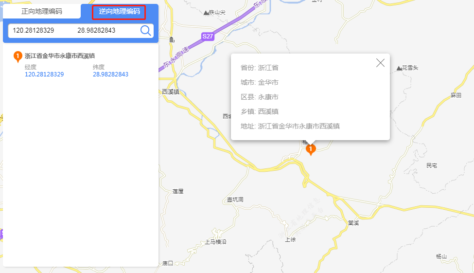

>

&emsp;&emsp;1. 单一正向匹配

&emsp;&emsp;用户进入平台【地理编码】模块，在正向地理编码面板，输入地名地址，点击搜索，面板展示搜索结果，并在地图上定位到结果点。

图4-1 单一正向匹配

&emsp;&emsp;2. 单一逆向匹配

&emsp;&emsp;切换到逆向地理编码面板，输入经纬度，点击搜索，面板展示搜索结果，并在地图上定位到结果点。

图4-2 单一逆向匹配
