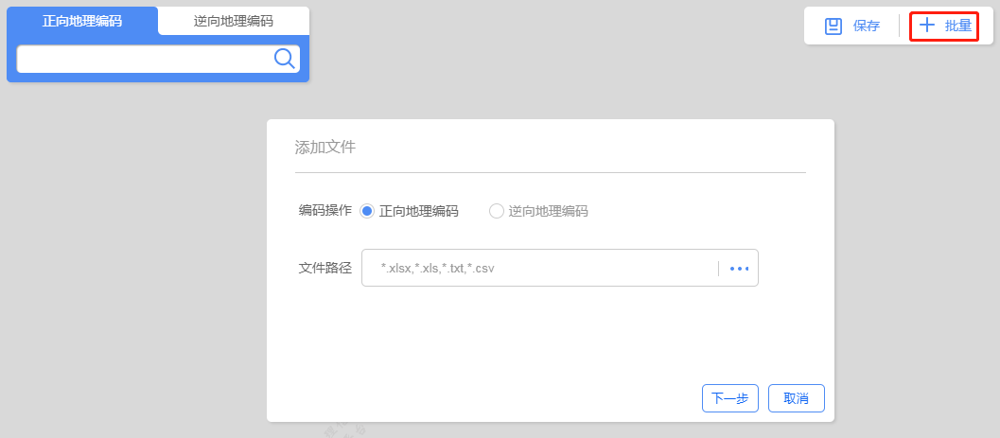
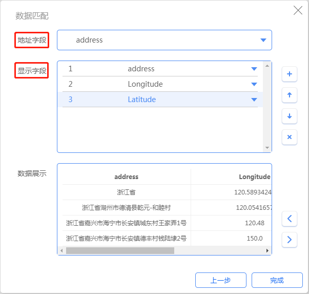
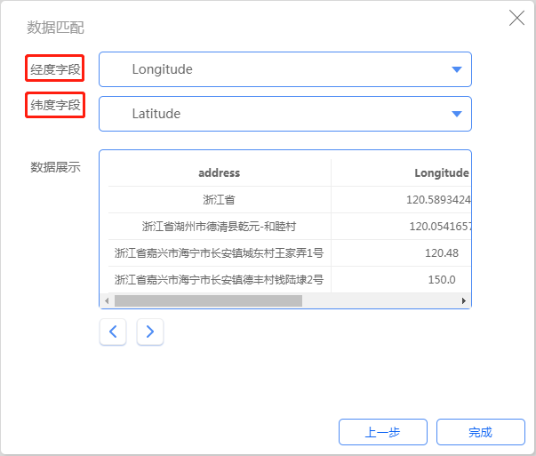

>

&emsp;&emsp;1. 添加文件

&emsp;&emsp;用户进入平台【地理编码】模块，点击“批量”按钮，弹出添加文件窗口，选择批量匹配的方式，并上传文件。

图4-3 添加文件

&emsp;&emsp;2. 批量正向匹配

&emsp;&emsp;在添加文件时选择“正向地理编码”后，数据匹配窗口需要设置“地址字段”和“显示字段”，点击“完成”按钮后，执行批量正向匹配。

图4-4 批量正向匹配

&emsp;&emsp;3. 批量逆向匹配

&emsp;&emsp;在添加文件时选择“逆向地理编码”后，数据匹配窗口需要设置“经度字段”和“纬度字段”，点击“完成”按钮后，执行批量逆向匹配。

图4-5 批量逆向匹配

