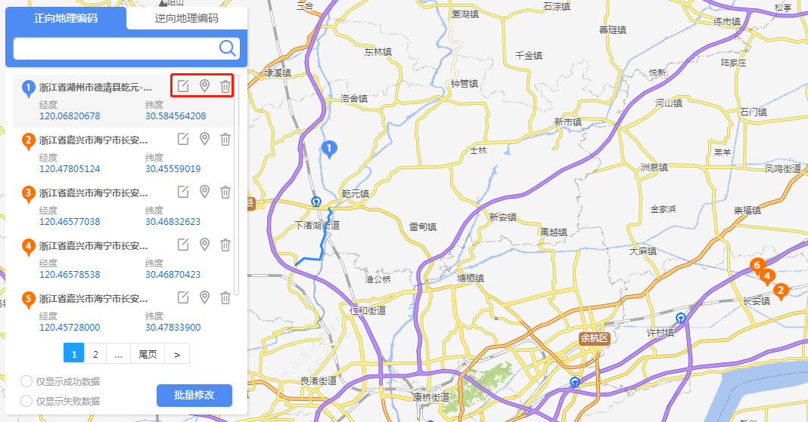
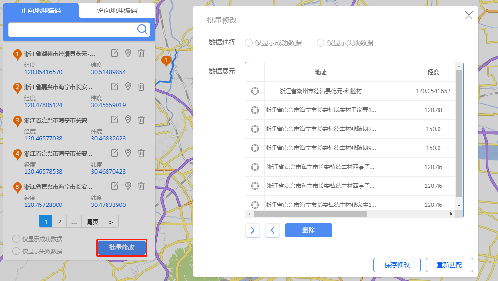

>

&emsp;&emsp;正向地理编码面板展示批量正向匹配的结果，逆向地理编码面板展示批量逆向匹配的结果，支持用户对匹配结果进行修改。

&emsp;&emsp;1. 单一结果编辑

&emsp;&emsp;用户在匹配结果面板中可以对匹配结果进行修改，包括：编辑匹配地址、在地图上拖动修改匹配的经纬度、删除匹配结果。

图4-6 批量匹配结果

&emsp;&emsp;2. 批量修改

&emsp;&emsp;用户点击“批量修改”按钮，弹出批量修改窗口，可以对上传文件进行修改并重新匹配。

图4-7 批量修改
