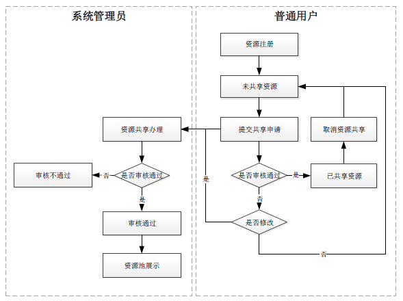
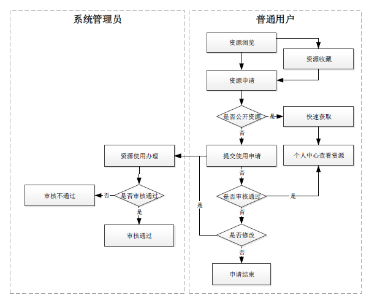
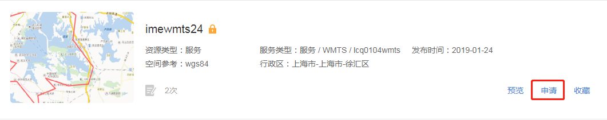
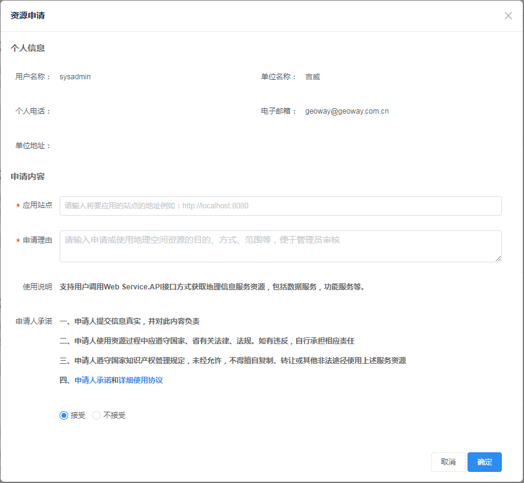
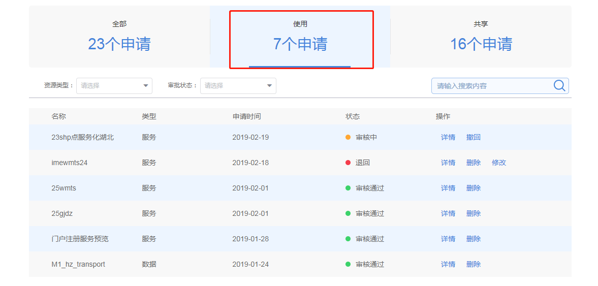
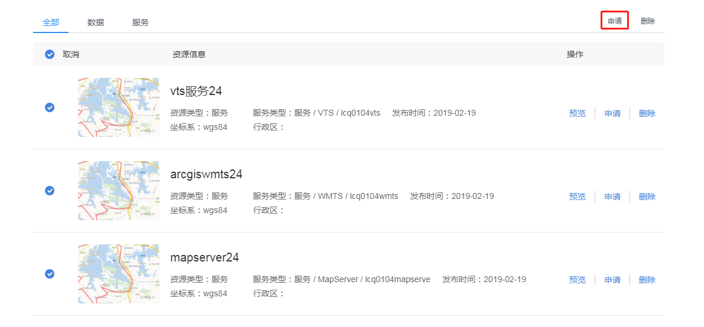
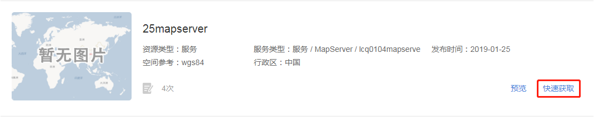
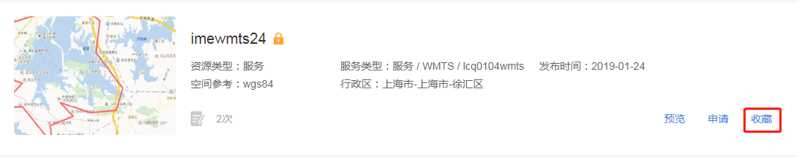

>## 概述

&emsp;&emsp;个人中心提供了用户管理个人资源的能力。用户可以向个人中心注册资源，并将个人资源共享到资源中心，便于其他用户使用。同时，用户在资源中心发现好的资源可以提交申请，将资源添加至个人中心使用。另外，资源的共享与申请都需要管理员的审核，流程图如下：

图2-4 资源共享流程

图2-5 资源申请流程

<!-- >## 个人资源注册

&emsp;&emsp;1. 数据注册

&emsp;&emsp;平台提供外部数据库表注册和本地上传两种数据注册方式。

&emsp;&emsp;用户登录平台系统，进入【个人中心&rarr;我的资源&rarr;数据】界面，点击“添加数据注册数据源”按钮，弹出数据注册窗口。填写数据注册信息并通过地址校验后，可成功注册一个矢量数据。

图2-6 添加数据按钮

图2-7 数据注册窗口

&emsp;&emsp;用户在【个人中心&rarr;我的资源&rarr;数据】界面，点击“添加数据&rarr;上传文件”按钮，弹出数据上传窗口。填写数据信息并上传文件后，可成功上传一个文件数据。

图2-8 数据上传窗口

&emsp;&emsp;个人中心的数据支持类型的转化。点击文件数据的“空间化”按钮，可以将文件数据转化为矢量数据或行政区划数据，点击矢量数据的“缓存”按钮，可以将矢量数据转化为矢量瓦片数据。

图2-9 空间化按钮和缓存按钮

&emsp;&emsp; 2. 服务注册

&emsp;&emsp;平台提供外部服务注册和在线定制两种服务注册方式。

&emsp;&emsp;用户登录平台系统，进入【个人中心&rarr;我的资源&rarr;服务】界面，点击“添加服务&rarr;服务注册”按钮，弹出服务注册窗口。填写服务注册信息并成功获取元数据后，可注册一个服务。

图2-10 服务注册窗口
 -->

<!-- >## 资源共享

&emsp;&emsp;1. 用户提交共享申请

&emsp;&emsp;用户登录平台系统，进入【个人中心&rarr;我的资源】界面，点击“共享”按钮，弹出共享申请窗口。填写基础信息、空间信息和权限信息，可提交申请，等待管理员的审核。资源状态由“未共享”变为“审核中”。

图2-11 共享按钮

图2-12 共享申请窗口

&emsp;&emsp;2. 用户查看审核结果

&emsp;&emsp;用户进入【个人中心&rarr;我的申请】界面，点击打开“共享”申请列表，可查看资源发布的结果。

&emsp;&emsp;状态为“审核通过”的资源，自动添加到【资源中心&rarr;资源目录】模块；“审核中”的资源，点击“撤回”取消共享；“退回”的资源，点击“删除”取消共享，点击“修改”可修改资源共享申请信息，再次提交申请。

图2-13 个人中心我的申请列表

&emsp;&emsp;用户进入【个人中心&rarr;我的资源】界面，可以查看资源的共享状态。管理员审核通过的资源，资源状态由“审核中”变为“已共享”；管理员退回的资源，资源状态由“审核中”变为“未共享”。

&emsp;&emsp;3. 用户取消共享

&emsp;&emsp;针对“审核中”和“已共享”的资源，用户可以点击“取消共享”按钮，【资源中心&rarr;资源目录】界面将不再展示取消共享的资源，已申请该资源的其他用户将不能预览和使用该资源。

图2-14 取消共享按钮
 -->

>## 资源申请 

&emsp;&emsp;1. 用户提交使用申请

&emsp;&emsp;用户登录平台系统，进入【资源中心&rarr;资源目录】界面，点击“申请”按钮，弹出资源申请窗口。填写应用站点和申请理由后，可提交申请，等待管理员的审核。

图2-6 资源申请按钮

图2-7 资源申请窗口

&emsp;&emsp;2. 用户查看审核结果

&emsp;&emsp;用户进入【个人中心&rarr;我的申请】界面，点击打开“使用”申请列表，可查看资源申请的结果。

&emsp;&emsp;状态为“审核通过”的资源，自动添加到【个人中心&rarr;我的资源】模块；“审核中”的资源，点击“撤回”取消申请；“退回”的资源，点击“删除”取消申请，点击“修改”可修改资源申请信息，再次提交申请。

图2-8 个人中心我的申请列表

&emsp;&emsp;4. 用户批量申请资源

&emsp;&emsp;平台支持同时申请多个资源。

&emsp;&emsp;用户在【资源中心&rarr;资源目录】界面，点击“收藏”按钮，可将资源收藏至个人中心。

图2-9 资源收藏按钮

&emsp;&emsp;在【个人中心&rarr;我的收藏】界面，展示了用户收藏的资源。勾选多个资源，点击批量“申请”按钮，填写申请表，可同时对多个资源提交申请。

图2-10 批量申请按钮

&emsp;&emsp;5. 用户快速获取资源

&emsp;&emsp;权限为完全公开的资源，用户可直接获取，无需管理员审核。

&emsp;&emsp;用户在【资源中心&rarr;资源目录】界面，点击完全公开资源的“快速获取”按钮，资源自动添加到【个人中心&rarr;我的资源】模块。

图2-11 资源快速获取按钮
