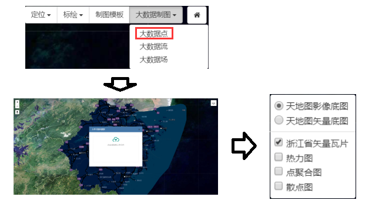
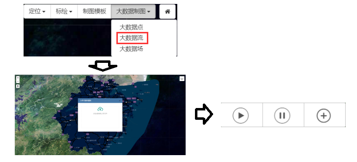
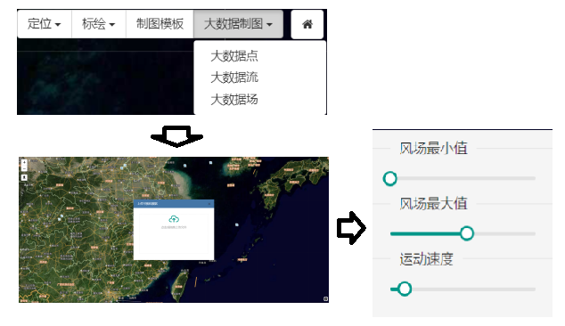

&emsp;&emsp;1.大数据点可视化

&emsp;&emsp;用户在专题制图页面点击右上角的“大数据制图”按钮，在下拉菜单中选择“大数据点”，可进入大数据点可视化页面，在弹出的上传数据面板中上传需要可视化的数据，然后在右上角的图层控制面板中可以选择散点图、点聚合图、热力图三种可视化方式，即可实现大数据点的可视化。

图4-1 大数据点可视化操作

&emsp;&emsp;2.大数据流可视化

&emsp;&emsp;用户在专题制图页面点击右上角的“大数据制图”按钮，在下拉菜单中选择“大数据流”，可进入大数据流可视化页面，在弹出的上传数据面板中上传需要可视化的数据，然后可以通过左下角的控制按钮进行动画的开始、暂停、添加数据。

图4-2 大数据流可视化操作

&emsp;&emsp;3.大数据场可视化

&emsp;&emsp;用户在专题制图页面点击右上角的“大数据制图”按钮，在下拉菜单中选择“大数据场”，可进入大数据场可视化页面，在弹出的上传数据面板中上传需要可视化的数据，然后可以点击右下角的配置按钮，进行场可视化的可视化样式配置。

图4-3 大数据场可视化操作
