&emsp;&emsp;在“我的专题图”界面上方工具栏点击“我要制图”按钮,用户可进入专题制图新建页面开展专题地图的定制工作。

&emsp;&emsp;1.制图模板选择

&emsp;&emsp;专题制图新建页面打开后，将自动弹出专题地图模板对话框，用户可以选择系统提供的制图模板进行制图，或新建空白模板制图。

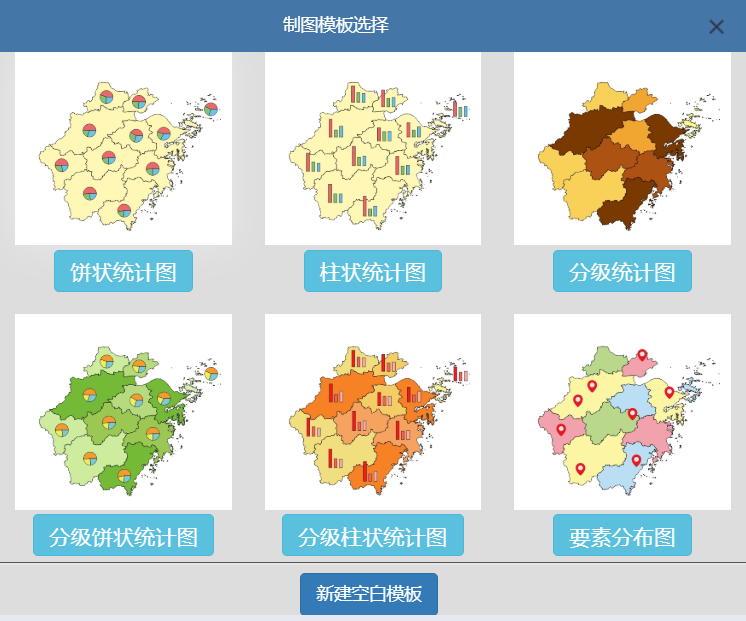

图3-1 制图模板选择对话框

&emsp;&emsp;系统内置有饼状统计图、柱状统计图、分级统计图、分级饼状统计图、分级柱状统计图和要素分布图六大类通用制图模板。每一类制图模板均内置了默认的专题数据源，并设定好了对应的专题符号。在制图模板选择面板点击对应的制图模板，就可以看到对应的制图模板效果。

&emsp;&emsp;（1）饼状统计图 
&emsp;&emsp;饼状统计图通过饼状统计符号进行制图可视化，模板中通过饼状图实现人口专题展示，包含男性人口数、女性人口数和总人口数三个指标，效果如下图3-2所示。

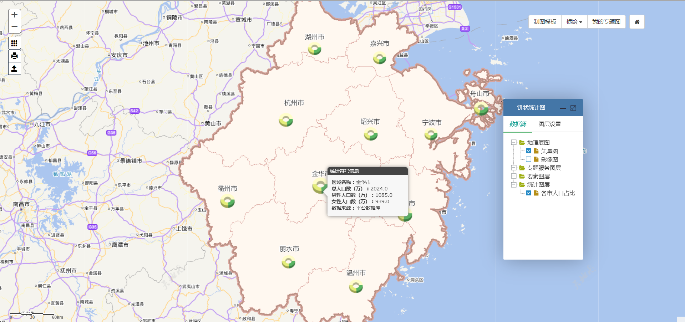

图3-2 饼状统计图制图模板

&emsp;&emsp;（2）柱状统计图 
&emsp;&emsp;柱状统计图通过柱状统计符号进行制图可视化，模板中通过柱状图实现农贸市场建设情况专题展示，包含已完成个数、目标完成个数两个指标，效果如下图3-3所示。

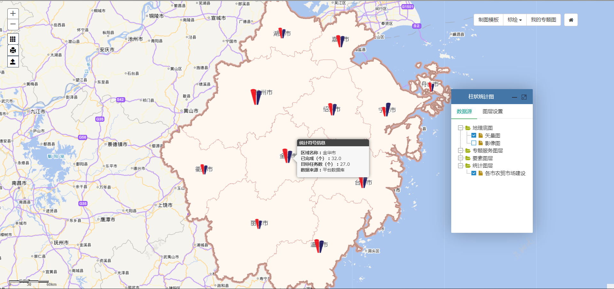

图3-3 柱状统计图制图模板

&emsp;&emsp;（3）分级统计图 
&emsp;&emsp;分级统计图通过分级设色进行制图可视化，分级统计图仅支持单指标。模板中实现经济专题展示，效果如下图3-4所示。

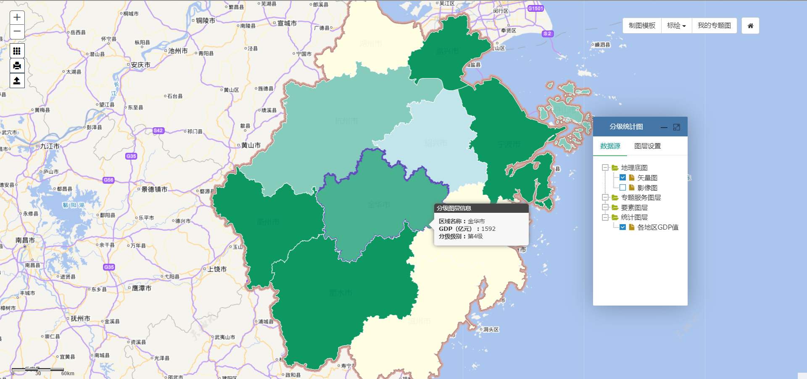

图3-4 分级统计图制图模板

&emsp;&emsp;（4）分级饼状统计图 
&emsp;&emsp;分级饼状统计图模板中，包含了分级设色专题图和饼状分区统计图层两部分。模板默认数据源为交通信息专题，饼状统计图包含轨道交通客运总量、公交客运总量两个指标；分级统计图包含公交车数目指标。制图模板的可视化效果如下图3-5所示。

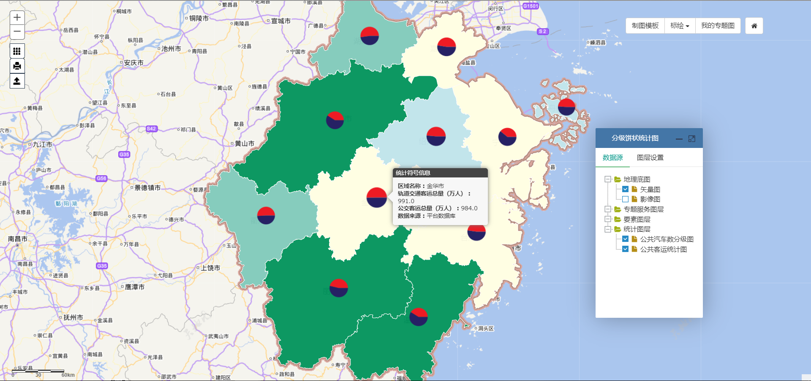

图3-5 分级饼状统计图制图模板

&emsp;&emsp;（5）分级柱状统计图 
&emsp;&emsp;分级柱状统计图模板中，包含了分级设色专题图和柱状分区统计图层两部分。模板默认数据源为交通信息专题，饼状统计图包含公交车数量、轨道交通运营车辆数两个指标；分级统计图包含公交车数目指标。制图模板的可视化效果如下图3-6所示。

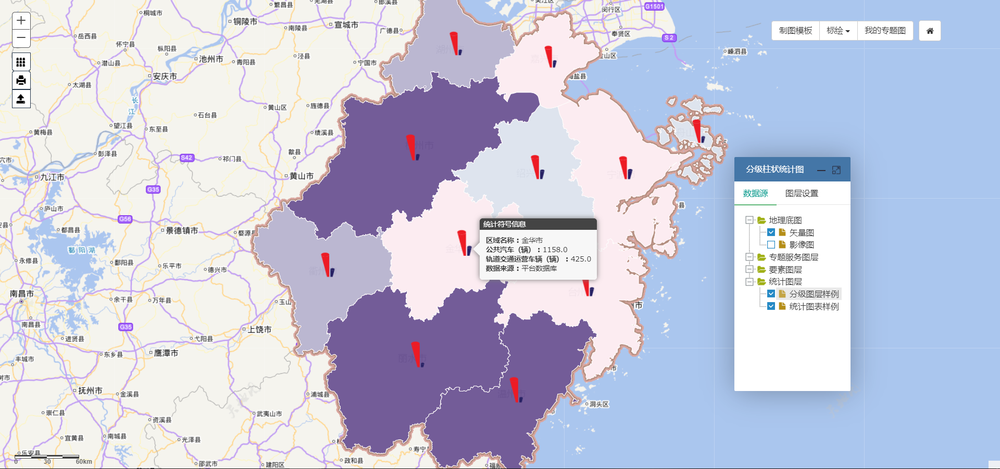

图3-6 分级柱状统计图制图模板

&emsp;&emsp;（6）要素分布图 
&emsp;&emsp;要素分布图模板中，地理底图图层、专题服务图层、要素图层三类。与统计图层不同，要素分布不是用来展示专题数据的统计信息，而是用来展示专题要素在空间上的分布现象。模板预置了森林防火等级分布专题服务图层，以及着火点、地级市点、医院、消防站、途径路线、地区界等点线面格式的专题要素。制图模板的可视化效果如下图3-7所示。

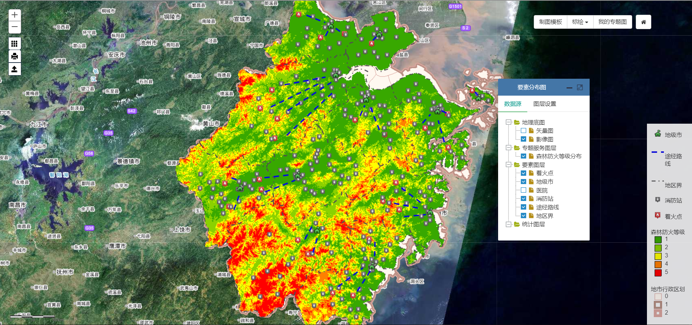

图3-7 要素分布制图模板

&emsp;&emsp;2.专题数据源定制

&emsp;&emsp;用户在制图的图层配置面板上，点击“统计图层”的“+”按钮，可以打开统计图具体的配图面板（图3-8）。

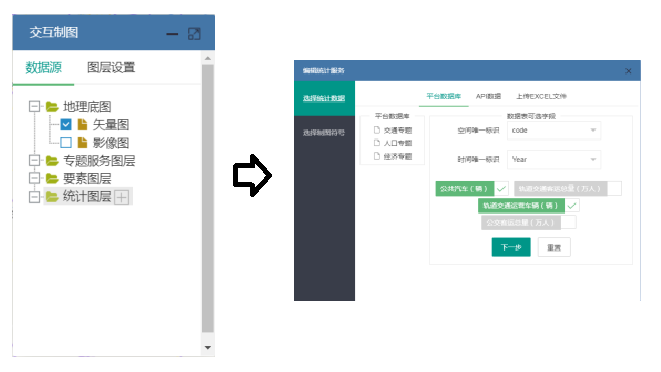

图3-8 打开统计图层配置面板

&emsp;&emsp;进入数据配置面板后，切换选项卡进行数据类型的选择（图3-9）。当数据源为平台数据库时，点击左侧数据表表名；数据源为API数据时，输入API链接地址并点击“链接数据”；数据源为上传统计数据时，按照提示上传Excel或csv文件。通过上述操作获得字段后，勾选用于绘图的指标，若勾选单一指标将制作分级统计图，勾选多个指标则将制作图表统计图。

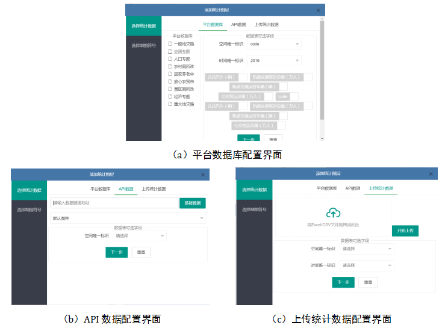

图3-9 专题数据源配置界面

&emsp;&emsp;3.专题符号样式定制

&emsp;&emsp;用户完成了数据源配置工作后，点击“下一步”可进入专题符号配置界面，按照符号类型可分为：（1）分级符号样式定制（图3-10）：通过拖动滑块修改分级符号的数量，修改透明度，点击“分级色系”，可以选择配色方案，若勾选“反色”选择框，则表示配色方案的渐变方式相反，同时可以通过下拉框选择不同的分级模型。（2）统计符号样式定制（图3-11）：可以选择统计符号的图表类型、配色方案，通过滑动滑块修改符号大小、透明度，通过输入的方式可以设置符号的偏移量。

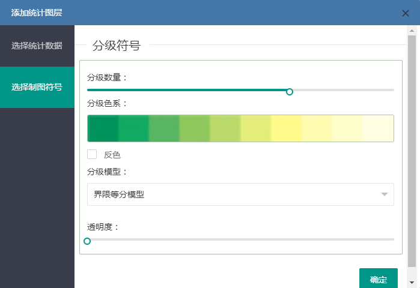

图3-10 分级符号样式配置面板

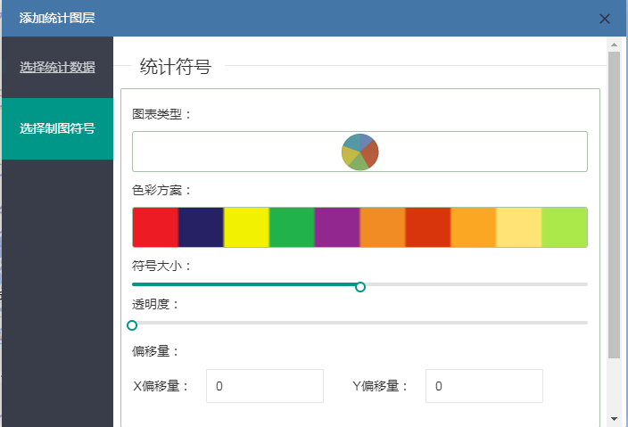

图3-11 统计符号样式配置面板

&emsp;&emsp;用户完成符号配置后，点击“确定”按钮，在弹出的对话框输入图层名称，即完成了一个统计图层的添加操作。在后续工作中。若需要编辑图层，可在图层配置面板的目录树中点击相应图层后的编辑按钮，将复原该图层的数据源和样式的配置面板（图3-12）。

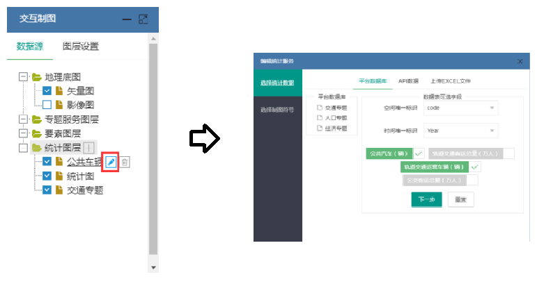

图3-12 专题图层的编辑
