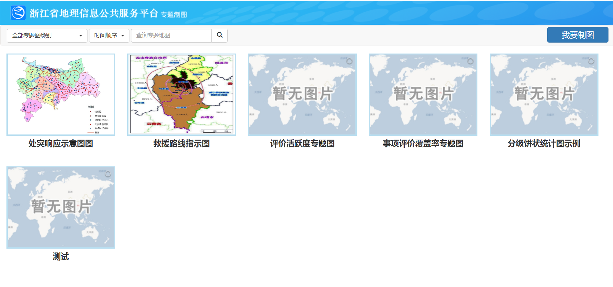
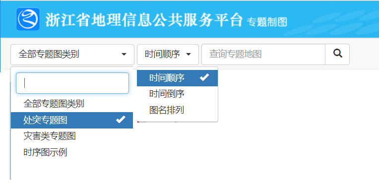
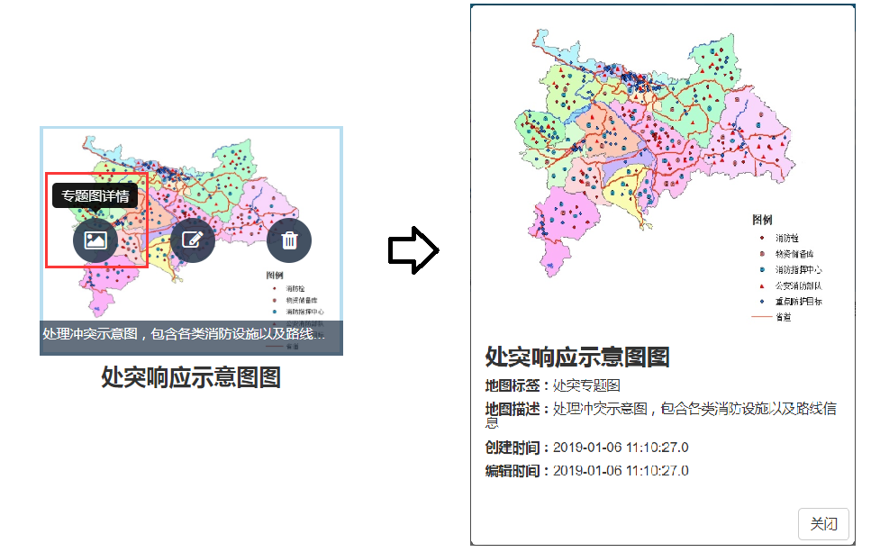
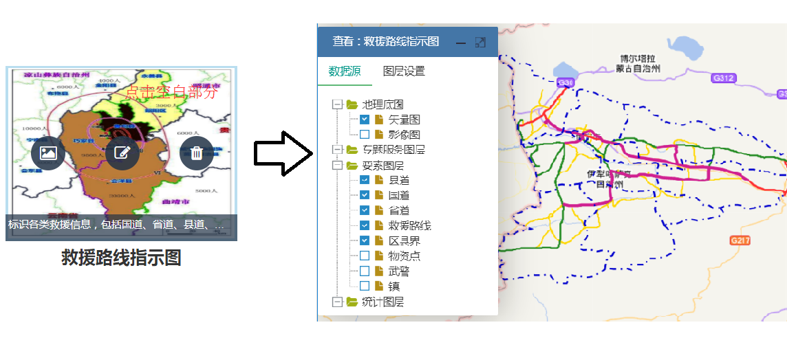
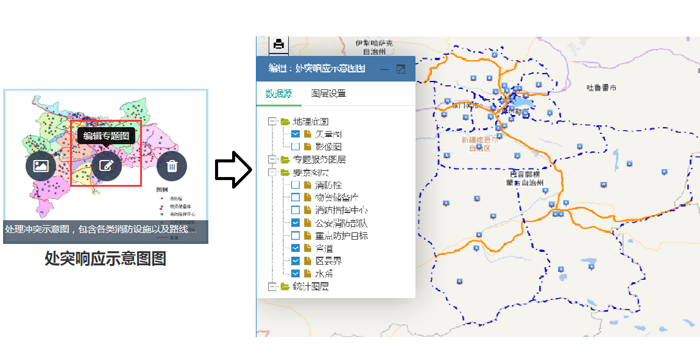
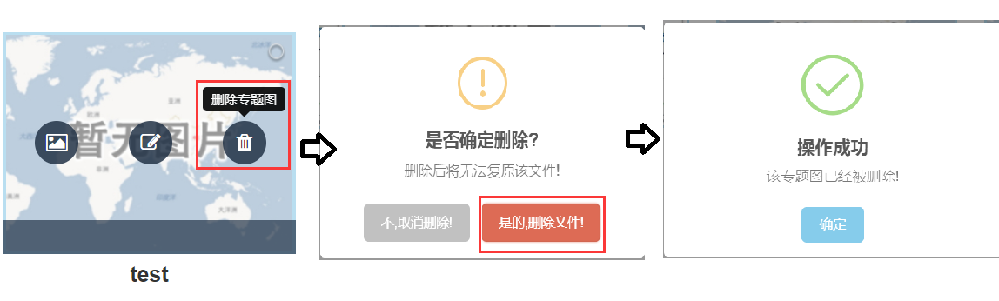
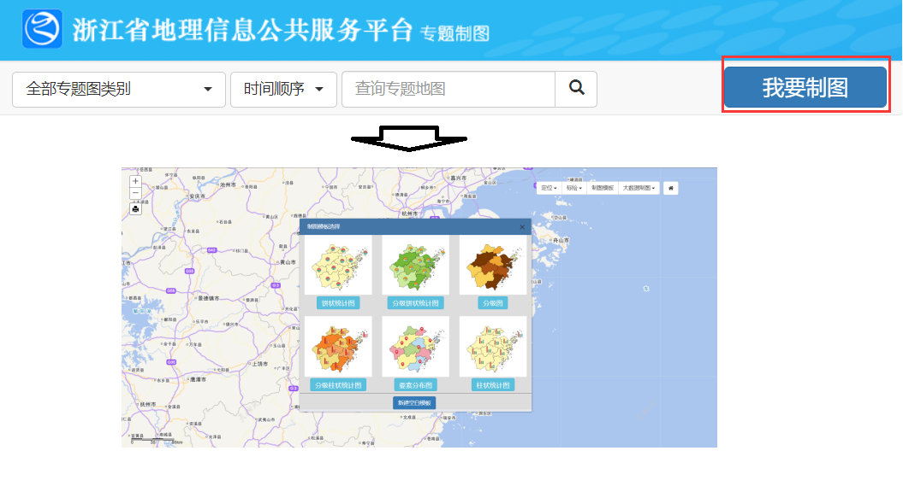

&emsp;&emsp;在“我的专题图”管理界面，登录用户可查看自己保存的所有专题图。

图1-1 专题地图管理界面

&emsp;&emsp;1.专题地图查询

&emsp;&emsp;系统对用户的专题图提供了多种查询方式，以便用户快速定位到需要操作的专题图，方便用户对专题图的管理。在“我的专题图”界面上方工具栏通过下拉菜单选择专题图类别、时间顺序或输入图名关键字即可查询。

图1-2 专题地图查询功能

&emsp;&emsp;2.专题地图详情信息查看

&emsp;&emsp;将鼠标置于需要查看的专题图上，点击出现的“查看”按钮，即跳出详细信息展示窗口供查看。

图1-3 专题图详情查看

&emsp;&emsp;3.专题地图浏览

&emsp;&emsp;在专题图管理界面点击需要查看专题图的空白部分，即跳转到专题图查看页面。

图1-4 专题地图浏览

&emsp;&emsp;4.专题地图编辑

&emsp;&emsp;将鼠标置于需要编辑的专题图上，选择出现的“编辑”按钮，即跳转到专题图编辑界面。

图1-5 专题地图编辑

&emsp;&emsp;5.专题地图删除

&emsp;&emsp;将鼠标置于需要删除的专题图上，选择出现的“删除”按钮，即可删除不需要的专题图。

图1-6 专题地图删除

&emsp;&emsp;6.新建专题图

&emsp;&emsp;在“我的专题图”界面上方工具栏点击“我要制图”按钮，即跳转到制图界面，开始新建专题图的制图工作。

图1-7 新建专题图
