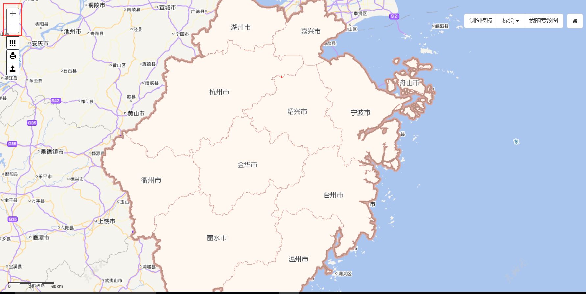
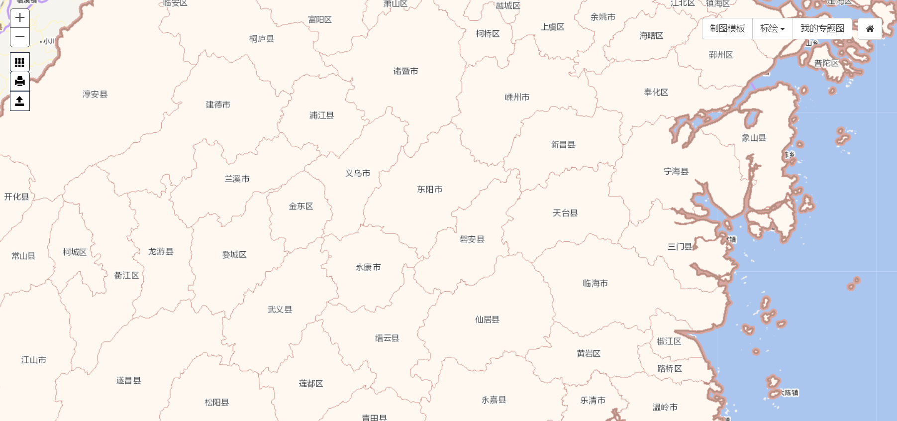
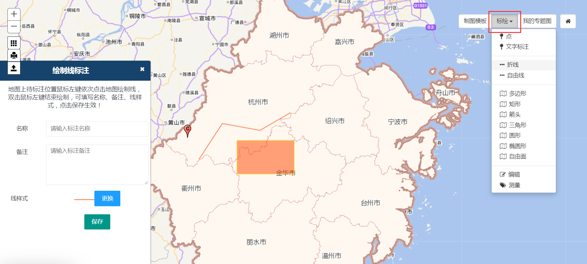
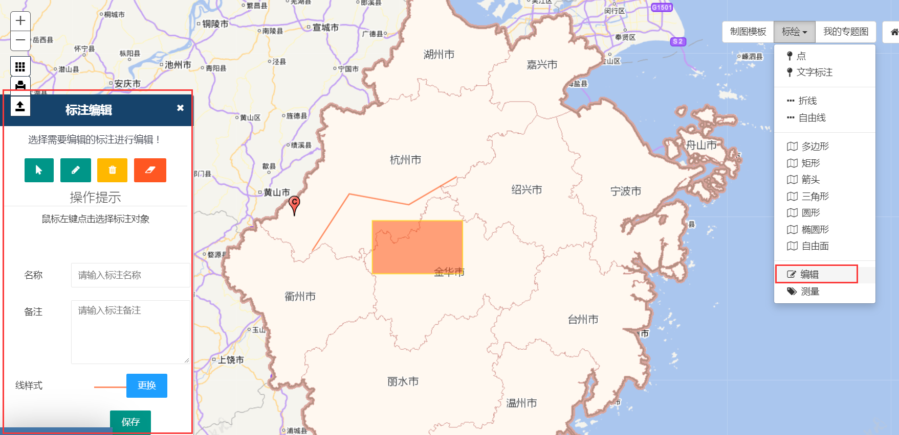
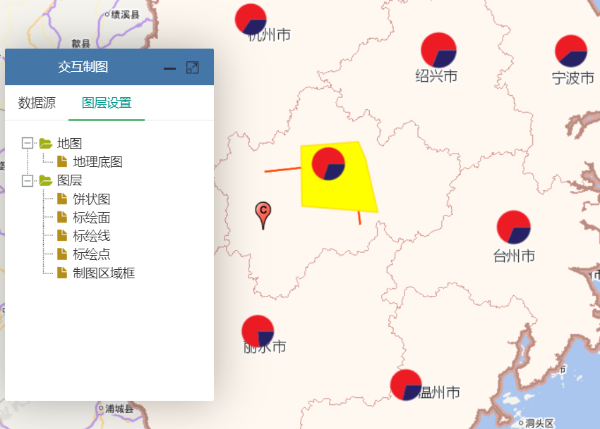
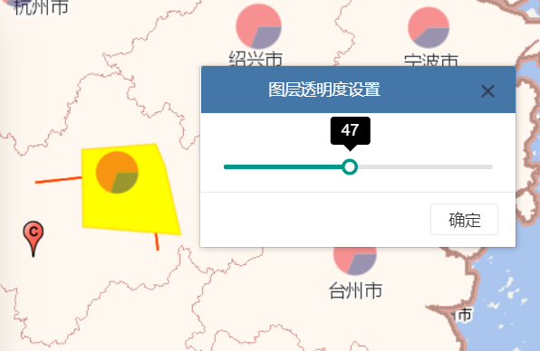

&emsp;&emsp;1.地图缩放

&emsp;&emsp;在专题图的新建、查看和编辑界面，利用鼠标滚轮或左上角缩放按钮可实现地图的缩放操作（图2-1），当地图放大到一定级别后，底图基本单元可由地市级变为县区级（图2-2）。

图2-1 地图缩放界面指引

图2-2 放大到县区级底图

&emsp;&emsp;2.地图漫游

&emsp;&emsp;在专题图的新建、查看和编辑界面，利用鼠标拖曳地图，可实现地图的平移浏览。

&emsp;&emsp;3.标绘

&emsp;&emsp;在专题图新建和查看界面，点击右上角的标绘按钮，在下拉列表中选择需要标绘的点、线或面符号类型，按照提示在图中绘制标绘符号，并在左侧弹出窗口中设置标绘符号名称、描述和样式等（图2-3）。

图2-3 添加标绘

&emsp;&emsp;如需对已添加的标绘符号进行编辑，则在上述下拉列表中点击“编辑”，按照提示在图中选取需要编辑的标绘符号，并在左侧弹出窗口中编辑相应内容（图2-4）。若需删除标绘符号，则点击删除或清空标绘按钮。

图2-4 编辑标绘

&emsp;&emsp;4.图层控制

&emsp;&emsp;在专题图新建、查看和编辑界面中，点击“图层设置”选项卡，则可在面板中按照从上至下的顺序显示地图和图层名称。用户可通过拖曳改变显示顺序（图2-5），也可点击地图或图层后在弹出的窗口中设置透明度（图2-6）。

图2-5 图层显示顺序调整

图2-6 图层透明度设置
