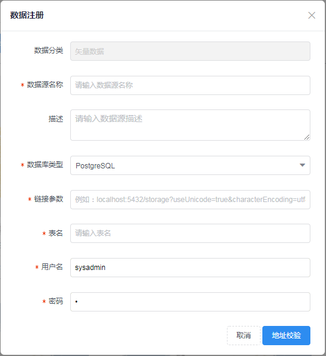
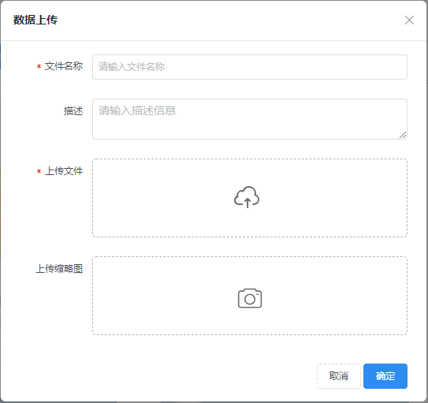
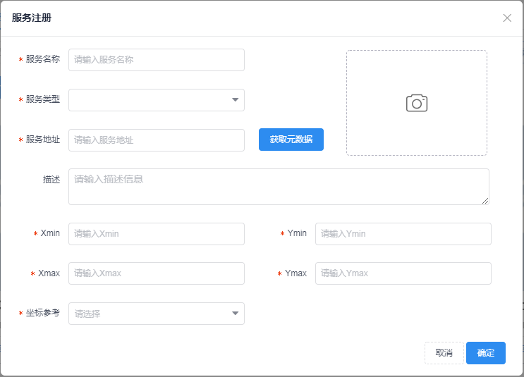
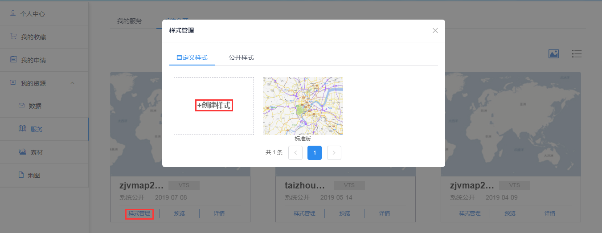
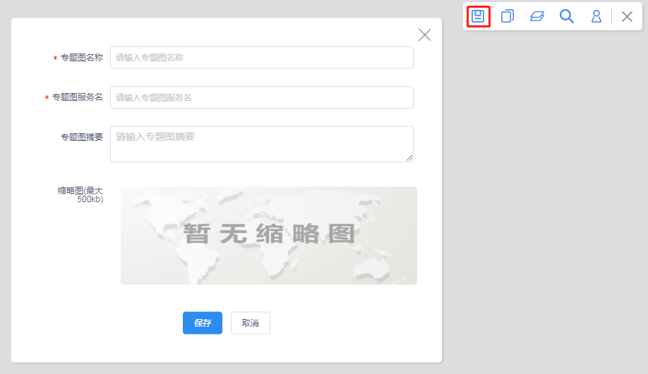

>

&emsp;&emsp;制作底图支持用户为矢量瓦片服务创建不同样式。

&emsp;&emsp;1. 进入制作底图界面

&emsp;&emsp;用户登录平台系统，进入【个人中心&rarr;我的资源&rarr;服务&rarr;系统公开】界面，点击“样式管理”按钮，弹出样式管理窗口，点击“创建样式”按钮，进入制作底图界面。也可以通过进入【个人中心&rarr;我的资源&rarr;地图】界面，点击“制作底图”按钮，进入制作底图界面。不同点在于，第一种方法点击样式管理时即为该服务定制底图，而第二种方法进入界面后再选择服务。

图3-1-1 创建样式

图3-1-2 制作底图

&emsp;&emsp;2. 新建要素

&emsp;&emsp;在制作底图的要素面板右击，点击“新建要素”按钮，弹出新建要素窗口，选择数据源，依次添加制作底图需要的要素。

图3-2 新建要素

&emsp;&emsp;3. 新建层级

&emsp;&emsp;切换到制作底图的样式面板右击，点击“新建层级”按钮，设置底图的显示级别。

图3-3 新建层级

&emsp;&emsp;4. 添加样式

&emsp;&emsp;在层级上右击，点击“添加样式”，弹出选择要素窗口，展示要素面板创建的要素，选择需要定制样式的要素。

图3-4 添加样式

&emsp;&emsp;5. 配置样式

&emsp;&emsp;点击样式，弹出样式配置窗口，设置样式参数，地图上同步显示样式效果。

图3-5 配置样式

&emsp;&emsp;6. 保存底图

&emsp;&emsp;点击工具条的保存按钮，弹出保存窗口，输入底图信息即可完成底图创建。

图3-6 保存底图

&emsp;&emsp;7. 注意事项

&emsp;&emsp;【个人中心&rarr;我的资源&rarr;地图】界面，单位用户可以发布地图，个人用户无法发布地图

图3-7 发布按钮

