>## 服务注册

&emsp;&emsp;平台提供外部服务注册和在线定制两种服务注册方式。

&emsp;&emsp;用户登录平台系统，进入【个人中心&rarr;我的资源&rarr;服务】界面，点击“添加服务&rarr;服务注册”按钮，弹出服务注册窗口。填写服务注册信息并成功获取元数据后，可注册一个服务。

图3-5 服务注册窗口

>## 制作底图

&emsp;&emsp;制作底图支持用户为矢量瓦片服务创建不同样式。

&emsp;&emsp;1. 进入制作底图界面

&emsp;&emsp;用户登录平台系统，进入【个人中心&rarr;我的资源&rarr;服务&rarr;系统公开】界面，点击“样式管理”按钮，弹出样式管理窗口，点击“创建样式”按钮，进入制作底图界面。也可以通过进入【个人中心&rarr;我的资源&rarr;地图】界面，点击“制作底图”按钮，进入制作底图界面。不同点在于，第一种方法点击样式管理时即为该服务定制底图，而第二种方法进入界面后再选择服务。

图3-6 创建样式

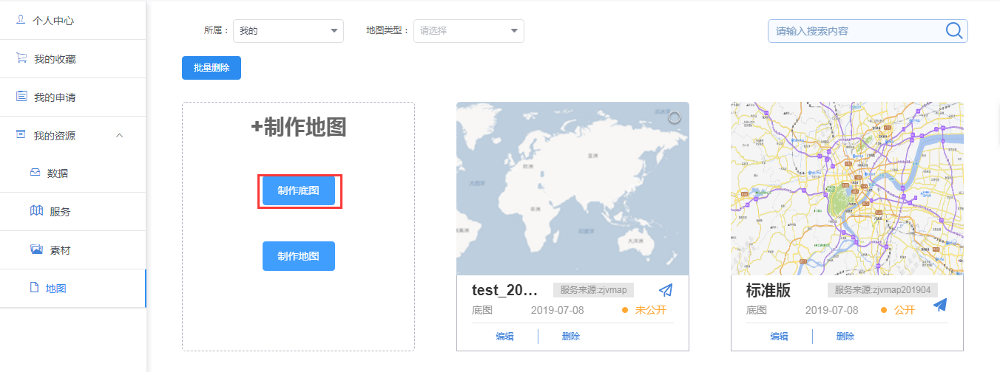

图3-7 制作底图

&emsp;&emsp;2. 新建要素

&emsp;&emsp;在制作底图的要素面板右击，点击“新建要素”按钮，弹出新建要素窗口，选择数据源，依次添加制作底图需要的要素。

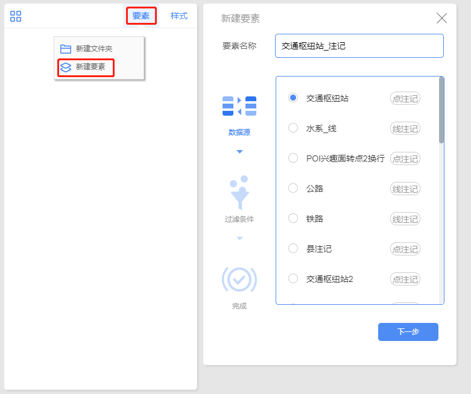

图3-8 新建要素

&emsp;&emsp;3. 新建层级

&emsp;&emsp;切换到制作底图的样式面板右击，点击“新建层级”按钮，设置底图的显示级别。

图3-9 新建层级

&emsp;&emsp;4. 添加样式

&emsp;&emsp;在层级上右击，点击“添加样式”，弹出选择要素窗口，展示要素面板创建的要素，选择需要定制样式的要素。

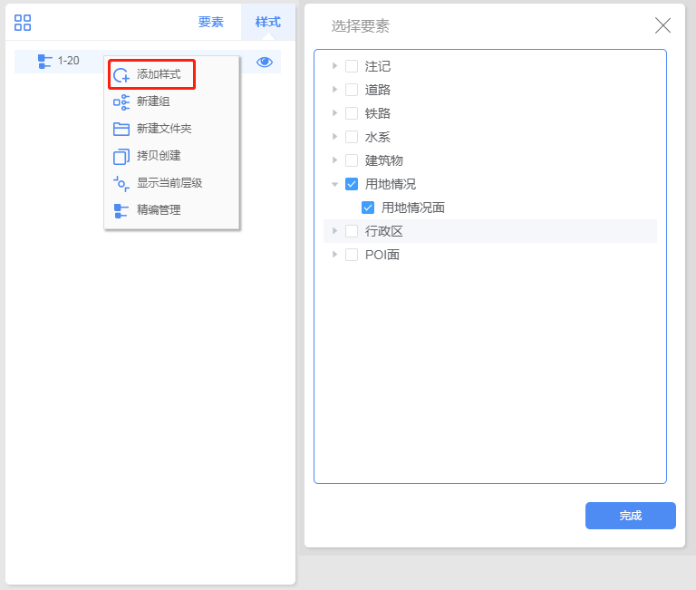

图3-10 添加样式

&emsp;&emsp;5. 配置样式

&emsp;&emsp;点击样式，弹出样式配置窗口，设置样式参数，地图上同步显示样式效果。

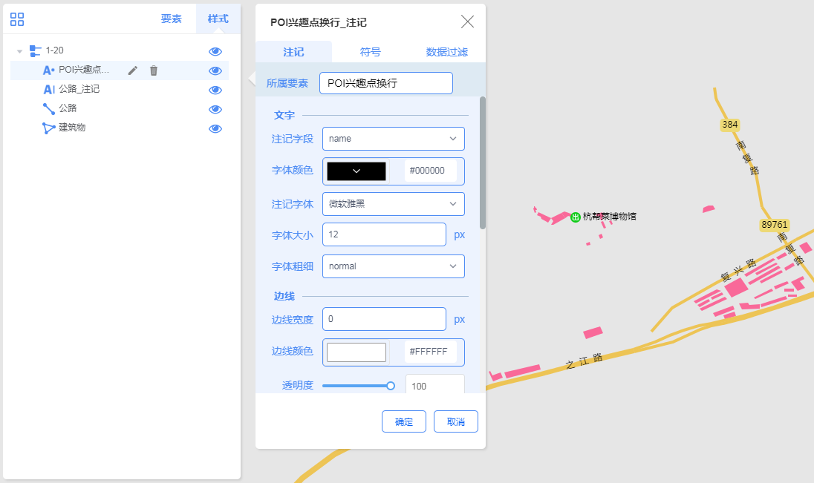

图3-11 配置样式

&emsp;&emsp;6. 保存底图

&emsp;&emsp;点击工具条的保存按钮，弹出保存窗口，输入底图信息即可完成底图创建。

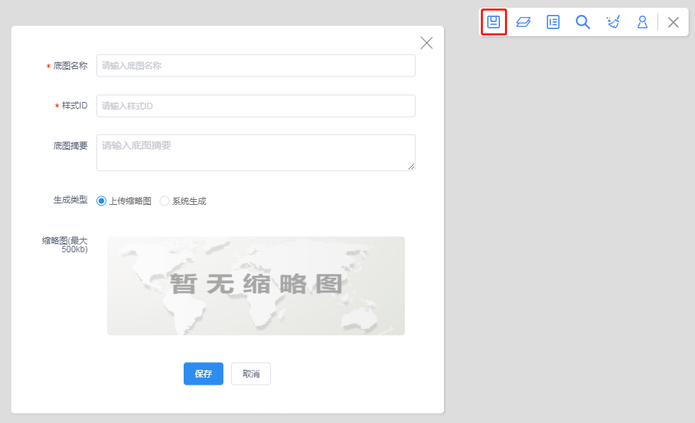

图3-12 保存底图

&emsp;&emsp;7. 注意事项

&emsp;&emsp;【个人中心&rarr;我的资源&rarr;地图】界面，单位用户可以发布地图，个人用户无法发布地图

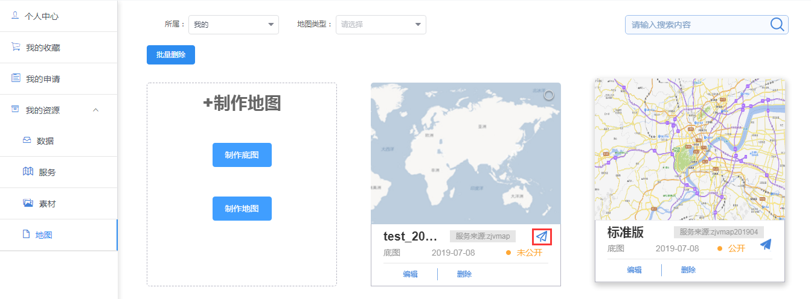

图3-13 发布按钮

>## 制作专题地图

&emsp;&emsp;专题图定制支持用户使用个人中心的数据创建标记专题图或者统计专题图。

&emsp;&emsp;1. 进入专题图定制界面

&emsp;&emsp;用户登录平台系统，进入【个人中心&rarr;我的资源&rarr;服务&rarr;我的服务】界面，点击“添加服务&rarr;专题地图”按钮，进入专题图定制界面。

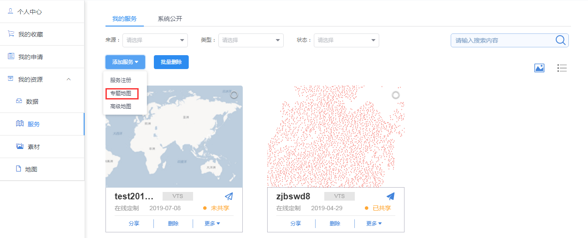

图3-14 添加专题图按钮

&emsp;&emsp;2. 新建要素

&emsp;&emsp;进入专题图定制界面，首先弹出添加数据窗口，选择POINT类型的数据进入标记专题图定制，选择POLYGON类型的数据进入统计专题图定制。

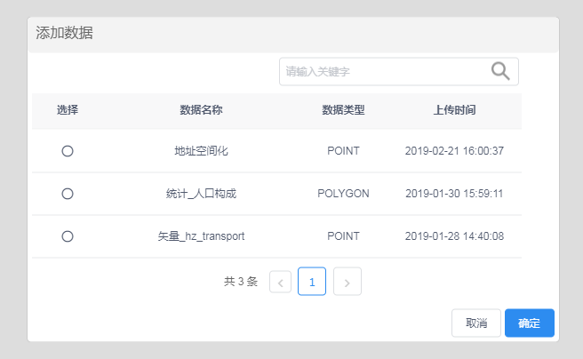

图3-15 添加数据

&emsp;&emsp;3. 标记专题图定制

&emsp;&emsp;标记专题图提供散点图、聚合图、格网图、蜂窝图、热力图共五种模板，选择模板后，设置模板参数，地图上同步显示标记图效果。

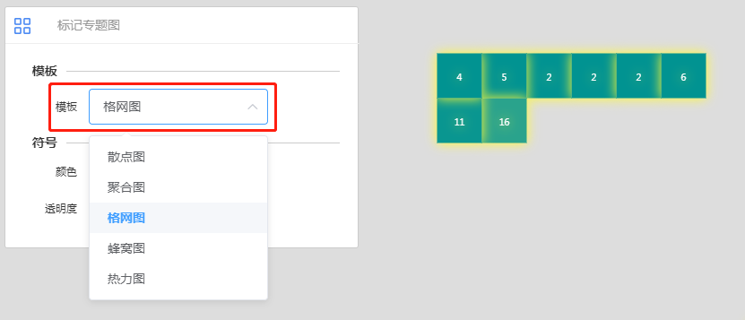

图3-16 标记专题图定制

&emsp;&emsp;4. 统计专题图定制

&emsp;&emsp;统计图提供饼状图和柱状图两种模板，选择模板后，设置模板和背景参数，地图上同步显示统计图效果。

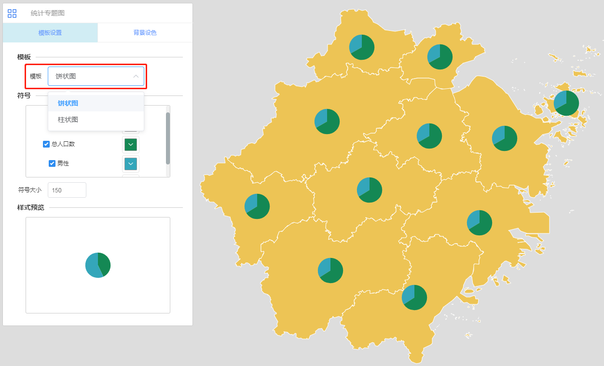

图3-17 统计专题图定制

&emsp;&emsp;5. 保存专题地图

&emsp;&emsp;点击工具条的保存按钮，弹出保存窗口，输入专题地图信息即可完成专题地图创建。

图3-18 保存专题地图

>## 制作地图

&emsp;&emsp;制作地图支持用户使用个人中心的矢量瓦片数据创建矢量瓦片服务。

&emsp;&emsp;1. 进入制作地图界面

&emsp;&emsp;用户登录平台系统，进入【个人中心&rarr;我的资源&rarr;服务&rarr;我的服务】界面，点击“添加服务&rarr;高级地图”按钮，进入制作地图界面。也可以通过进入【个人中心&rarr;我的资源&rarr;地图】界面，点击“制作地图”按钮，进入制作地图界面。不同点在于，第一种方法点击样式管理时即为该服务定制地图，而第二种方法进入界面后再选择服务。

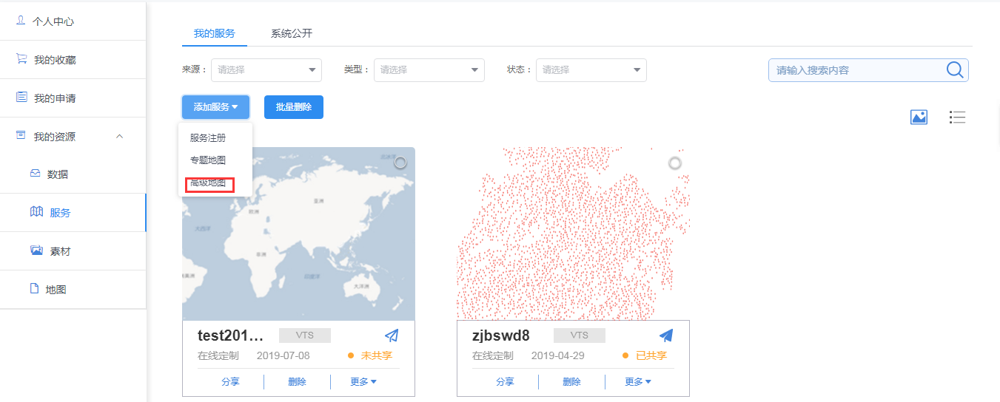

图3-19 添加高级地图按钮

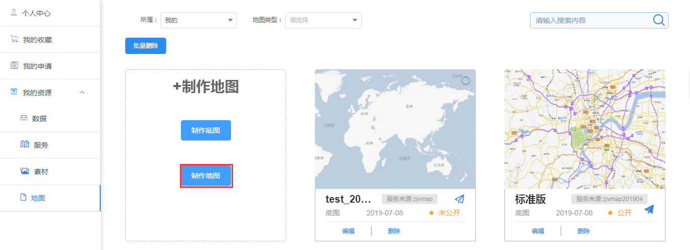

图3-20 制作地图按钮

&emsp;&emsp;2. 新建要素

&emsp;&emsp;在制作地图的要素面板右击，点击“新建要素”按钮，选择数据源，依次添加制作地图需要的要素。

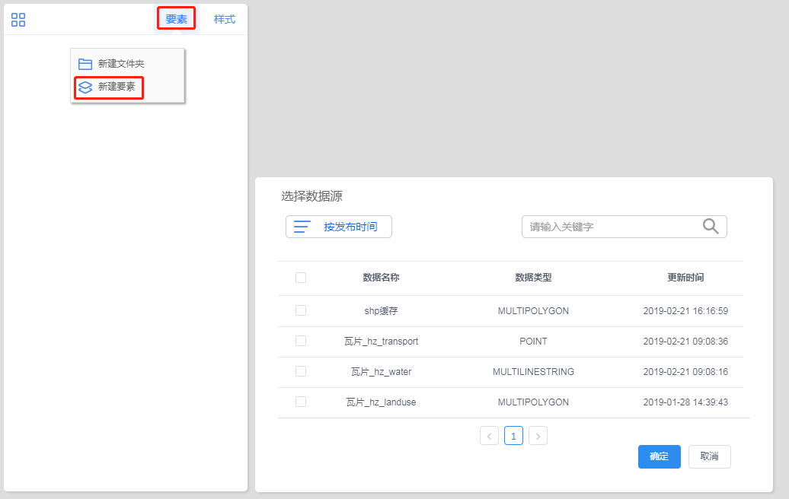

图3-21 新建要素

&emsp;&emsp;3.新建层级

&emsp;&emsp;切换到底图定制的样式面板右击，点击“新建层级”按钮，设置底图的显示级别。

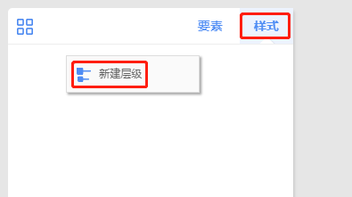

图3-22 新建层级

&emsp;&emsp;4. 添加样式

&emsp;&emsp;在层级上右击，点击“添加样式”，弹出选择要素窗口，展示要素面板创建的要素，选择需要定制样式的要素。

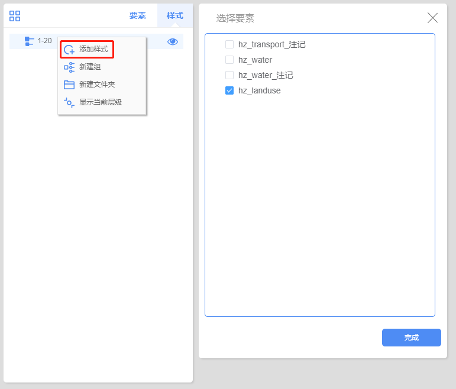

图3-23 添加样式

&emsp;&emsp;5. 配置样式

&emsp;&emsp;点击样式，弹出样式配置窗口，设置样式参数，地图上同步显示样式效果。

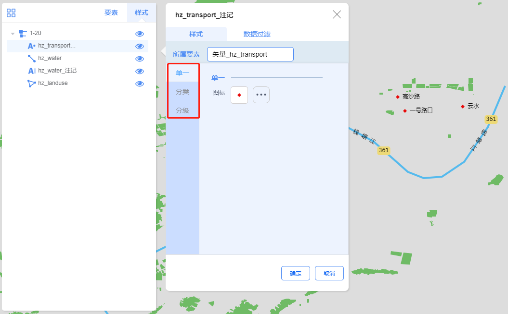

图3-24 配置样式

&emsp;&emsp;6. 保存地图

&emsp;&emsp;点击工具条的保存按钮，弹出保存窗口，输入高级地图信息即可完成高级地图创建。

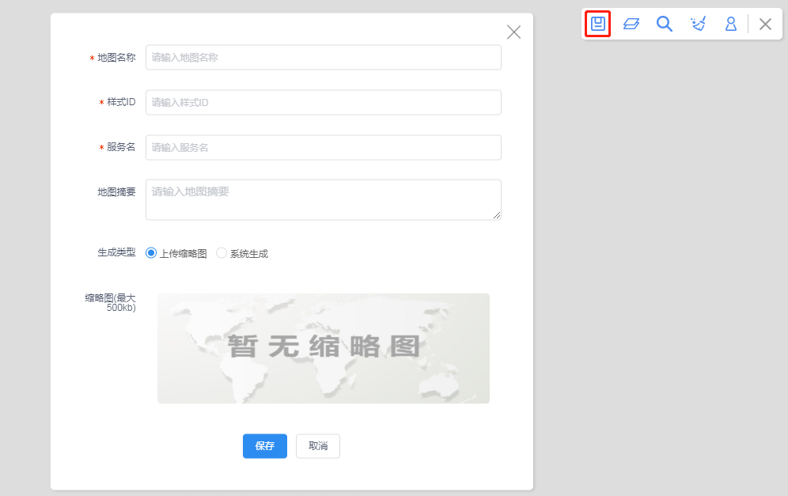

图3-25 保存地图

