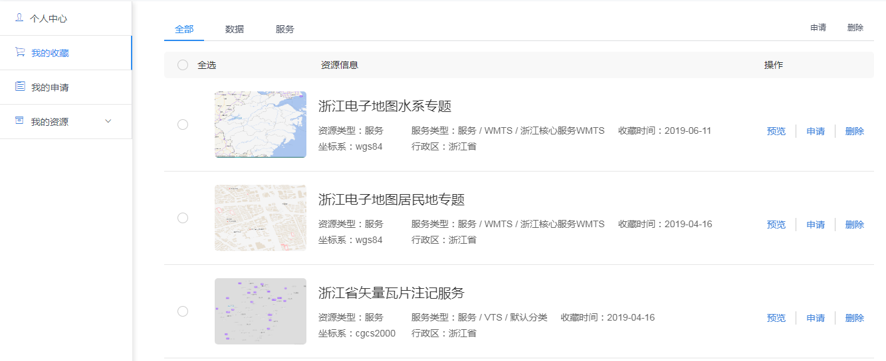
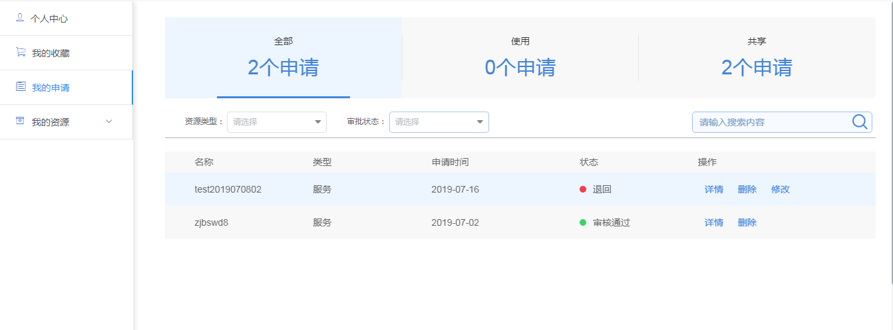

>## 我的收藏

&emsp;&emsp;我的收藏页面展示用户在资源中心所收藏的资源的记录，用户可在记录中对该资源进行申请、预览或者删除该条申请操作

图3-32 我的收藏

>## 我的申请

&emsp;&emsp;我的申请页面展示用户在资源中心所申请资源使用的记录和在个人中心进行资源共享发布的申请记录，用户可在记录中查看该申请的详情、审批状态，删除或修改该条申请记录

图3-33 我的申请
