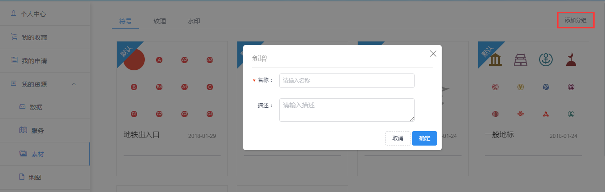
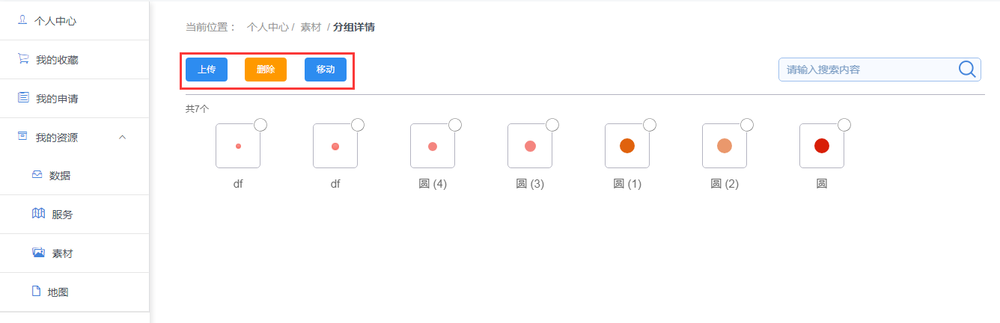

>
&emsp;&emsp;素材管理提供用户管理各种符号、文理和水印的功能

&emsp;&emsp;1. 创建分组

&emsp;&emsp;用户登录平台系统，进入【个人中心&rarr;我的资源&rarr;素材】界面，点击“添加分组”按钮，弹出创建分组弹窗，输入分组名即可创建分组

图3-26 添加分组弹窗

&emsp;&emsp;1. 上传、删除、移动图标

&emsp;&emsp;用户登录平台系统，进入【个人中心&rarr;我的资源&rarr;素材】界面，点击进入某个分组，点击上面按钮栏相应按钮即可对图标进行上传、删除、移动操作

图3-27 上传、删除、移动按钮
