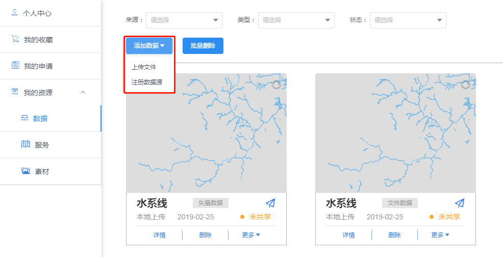
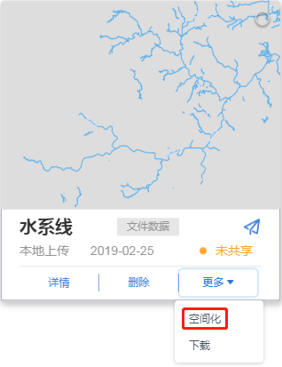
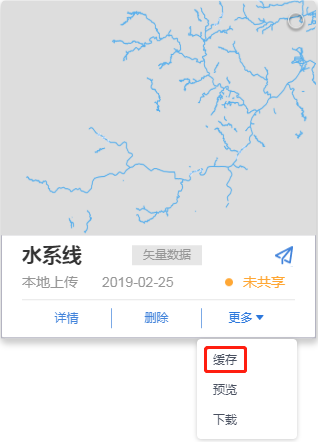

>## 数据注册

&emsp;&emsp;平台提供外部数据库表注册和本地上传两种数据注册方式。

&emsp;&emsp;用户登录平台系统，进入【个人中心&rarr;我的资源&rarr;数据】界面，点击“添加数据注册数据源”按钮，弹出数据注册窗口。填写数据注册信息并通过地址校验后，可成功注册一个矢量数据。

图3-1 添加数据按钮

图3-2 数据注册窗口

&emsp;&emsp;用户在【个人中心&rarr;我的资源&rarr;数据】界面，点击“添加数据&rarr;上传文件”按钮，弹出数据上传窗口。填写数据信息并上传文件后，可成功上传一个文件数据。

图3-3 数据上传窗口

>## 数据空间化和缓存

&emsp;&emsp;个人中心的数据支持类型的转化。点击文件数据的“空间化”按钮，可以将文件数据转化为矢量数据或行政区划数据，点击矢量数据的“缓存”按钮，可以将矢量数据转化为矢量瓦片数据。

图3-4 空间化按钮和缓存按钮
