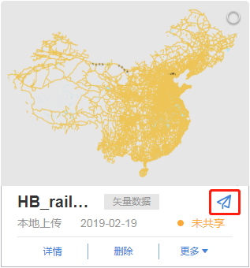
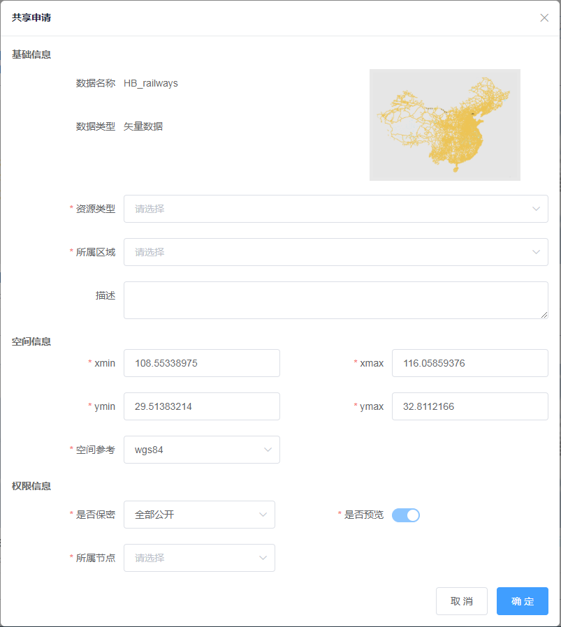
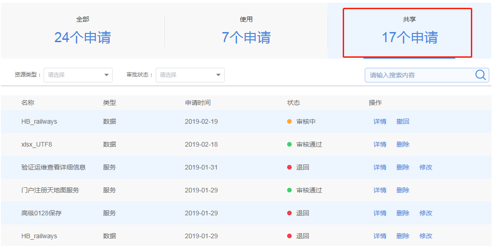
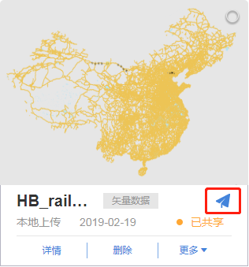

>
&emsp;&emsp;1. 用户提交共享申请

&emsp;&emsp;用户登录平台系统，进入【个人中心&rarr;我的资源】界面，点击“共享”按钮，弹出共享申请窗口。填写基础信息、空间信息和权限信息，可提交申请，等待管理员的审核。资源状态由“未共享”变为“审核中”。地图的共享操作不需要审核，但是单位用户可以共享，个人用户不可以共享。

图3-28 共享按钮

图3-29 共享申请窗口

&emsp;&emsp;2. 用户查看审核结果

&emsp;&emsp;用户进入【个人中心&rarr;我的申请】界面，点击打开“共享”申请列表，可查看资源发布的结果。

&emsp;&emsp;状态为“审核通过”的资源，自动添加到【资源中心&rarr;资源目录】模块；“审核中”的资源，点击“撤回”取消共享；“退回”的资源，点击“删除”取消共享，点击“修改”可修改资源共享申请信息，再次提交申请。

图3-30 个人中心我的申请列表

&emsp;&emsp;用户进入【个人中心&rarr;我的资源】界面，可以查看资源的共享状态。管理员审核通过的资源，资源状态由“审核中”变为“已共享”；管理员退回的资源，资源状态由“审核中”变为“未共享”。

&emsp;&emsp;3. 用户取消共享

&emsp;&emsp;针对“审核中”和“已共享”的资源，用户可以点击“取消共享”按钮，【资源中心&rarr;资源目录】界面将不再展示取消共享的资源，已申请该资源的其他用户将不能预览和使用该资源。

图3-31 取消共享按钮
